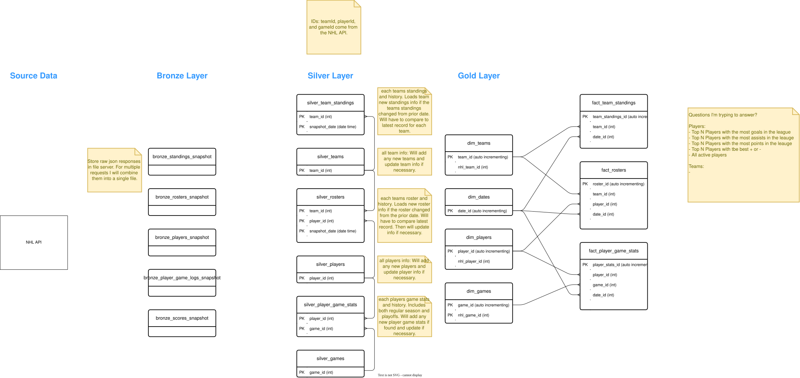
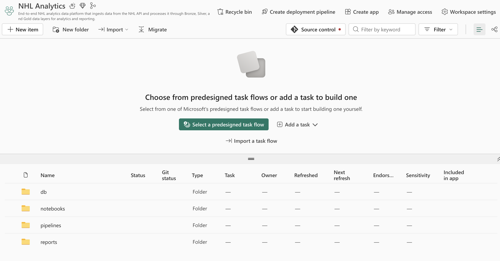
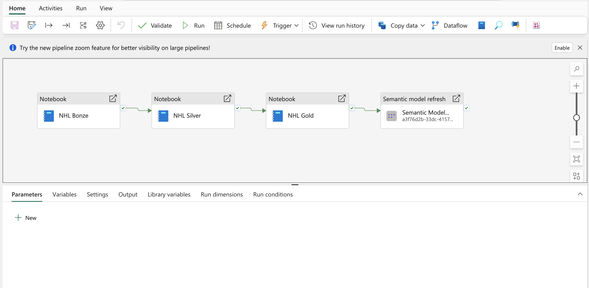
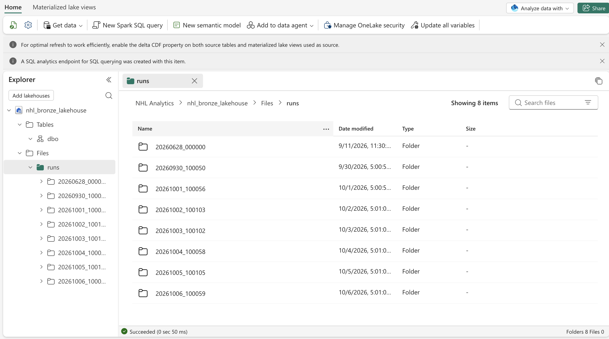
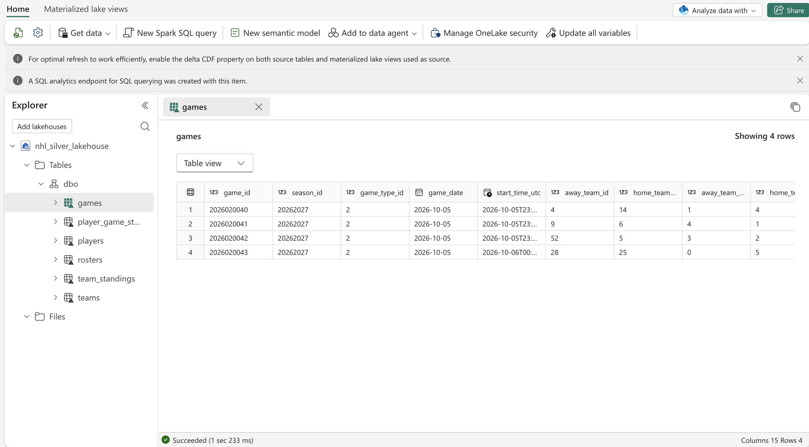
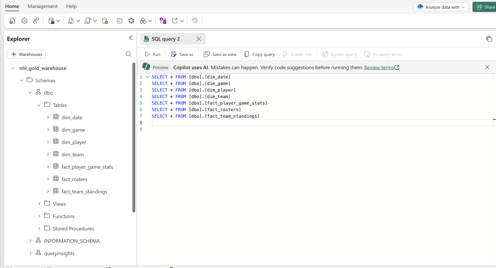
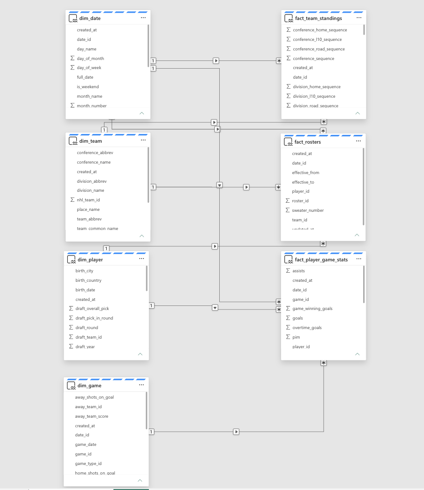
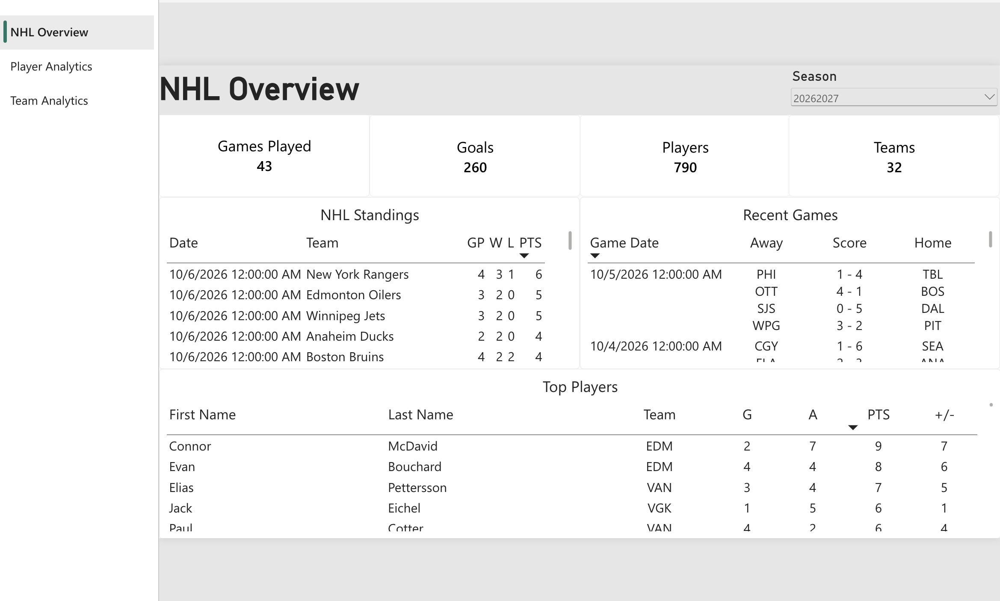
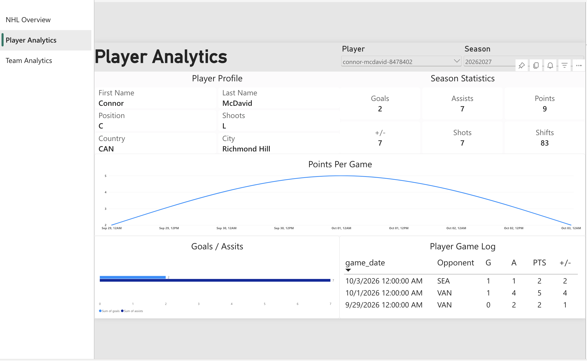
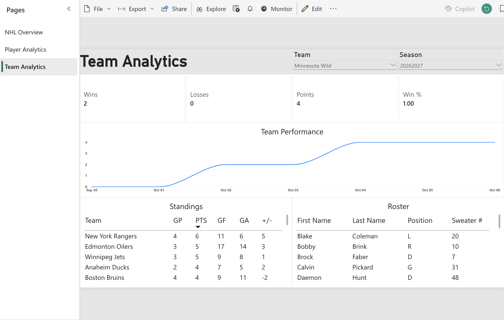

# NHL Analytics Platform

## Table of Contents

- [Overview](#overview)
- [Project Showcase](#project-showcase)
- [Installation and Set Up](#installation-and-set-up)
- [Usage](#usage)

## Overview

This project is an end to end NHL analytics data platform that collects hockey data from the NHL
API, processes and integrates the data using a medallion architecture, and stores the resulting
datasets in a dimensional data warehouse for analytics and reporting.



- Architecture Overview:
  1. Bronze Layer: Ingests raw data from the NHL API and stores the API responses as JSON Lines
     (`.jsonl`) files. The Bronze layer preserves the source data with minimal transformation so
     that the original API responses can be retained for historical purposes and reprocessing.
  2. Silver Layer: Cleans, validates, normalizes, and integrates the Bronze data into a structured
     relational model. The Silver layer contains normalized (3rd normal form) tables designed to
     provide a consistent and reliable representation of NHL data.
  3. Gold Layer: Transforms the Silver data into analytics-ready dimensional models using a star
     schema. The Gold layer contains dimensions and fact tables designed for reporting and business
     intelligence workloads.
  4. Semantic Model: Connects the Gold Warehouse to Power BI and defines the relationships,
     measures, calculations, and business logic used for analytics. The semantic model uses Direct
     Lake to provide efficient access to the underlying analytical data.
  5. Reporting Layer: Provides interactive dashboards and visualizations built in Power BI. The
     reporting layer presents NHL performance metrics and insights using the data and business logic
     defined in the semantic model.

- Tech Used:
  1. Microsoft Fabric: End to end data platform used for data ingestion, storage, transformation,
     orchestration, and analytics. Utilizes Fabric Lakehouses for Bronze/Silver data layers, a
     Fabric Warehouse for the Gold layer, and Power BI with Direct Lake for reporting and
     visualization.
  2. Python: Primary programming language used for data ingestion, transformation, validation, and
     pipeline development.
  3. PySpark: Used within Microsoft Fabric notebooks to process and transform datasets stored in
     Delta Lake.
  4. SQL: Used for data modeling, querying, validation, and loading analytical data into the Gold
     Warehouse.
  5. Power BI: Used to build the analytical semantic model, dashboards, visualizations, and NHL
     performance metrics using the Gold Warehouse.
  6. GitHub: Used for source control, version management, and collaboration on the project's
     notebooks, Python utilities, and supporting code.

## Project Showcase

The following screenshots provide an overview of the completed Microsoft Fabric implementation,
including the data pipeline, Lakehouses, Gold Warehouse, semantic model, and Power BI reports.

- Fabric Workspace: The Microsoft Fabric workspace contains the resources used to build and
  orchestrate the NHL Analytics platform.



- NHL Analytics Pipeline: The `nhl_analytics_pipeline` orchestrates the Bronze, Silver, and Gold
  notebooks in the correct order.



- Bronze Lakehouse: The Bronze Lakehouse stores raw NHL API responses as JSON Lines (`.jsonl`) files
  organized by pipeline run.



- Silver Lakehouse: The Silver Lakehouse contains cleaned, validated, normalized, and integrated NHL
  datasets stored as Delta tables.



- Gold Warehouse: The Gold Warehouse contains the dimensional model used for analytics and
  reporting.



- Semantic Model: The Power BI semantic model connects the Gold Warehouse to Power BI and provides
  the analytical model used by the reports. It defines the relationships between dimensions and fact
  tables, along with the measures, calculations, and business logic used to analyze NHL data.



- Power BI Reports: The Power BI report provides interactive dashboards for exploring NHL
  performance at the league, team, player, and game levels. The following report pages provide
  different views of the underlying analytical data.

  - NHL Overview: The NHL Overview page provides a high-level view of league activity and
    performance. It summarizes key NHL metrics, team standings, recent games, and player performance
    to give users an overall view of the league.

    

  - Player Analytics: The Player Analytics page focuses on individual player performance. It
    provides statistics such as goals, assists, points, and shots, allowing users to compare players
    and analyze offensive performance.

    

  - Team Analytics:  The Team Analytics page focuses on team-level performance and standings. It
    provides metrics such as wins, losses, points, goals for, and goals against to allow users to
    compare teams and evaluate performance throughout the season.

    

## Installation and Set Up

The NHL Analytics Platform is built entirely within Microsoft Fabric. A Microsoft Fabric
environment must be provisioned before the project resources can be created and the pipeline can
be executed.

1. Create a Microsoft Azure Account:
   - Sign in to the [Microsoft Azure Portal](https://portal.azure.com/).
   - Create or use an Azure subscription that will be used to provision the Microsoft Fabric
     environment.
   - Microsoft Fabric uses Microsoft Entra ID for identity and access management.

2. Create a Microsoft Entra User:
   - In the Azure Portal, navigate to --Microsoft Entra ID--.
   - Create a dedicated user account for the Fabric environment.
   - Assign the user the appropriate permissions required to access and administer the Fabric
     resources used by the project.
   - Sign in to Microsoft Fabric using this user account.

3. Enable Microsoft Fabric:
   - In the Azure Portal, provision the Microsoft Fabric capacity/environment required for the
     project.
   - Ensure the Fabric user created above has access to the Fabric capacity.
   - Assign the appropriate Fabric permissions to the user so that they can create and manage
     workspaces, Lakehouses, Warehouses, notebooks, pipelines, and Power BI resources.

4. Create the Microsoft Fabric Workspace:
   - Sign in to [Microsoft Fabric](https://www.microsoft.com/en-us/microsoft-fabric) using the
     configured Fabric user.
   - Create a workspace for the NHL Analytics Platform.
   - Ensure the workspace is assigned to the appropriate Fabric capacity.

5. Connect Fabric to GitHub:
   - Connect the Fabric workspace to the project's GitHub repository.
   - Configure the Git integration using a GitHub account with access to the repository.
   - Synchronize the repository with the Fabric workspace so that the project's notebooks and
     supporting code are available within Fabric.

6. Configure the Project:
   - Verify that the Bronze and Silver Lakehouses are available to the notebooks.
   - Verify that the Gold Warehouse is accessible for loading and querying analytical data.
   - Configure any required authentication or connection settings for the NHL API, Fabric
     resources, and GitHub integration.
   - Verify that the Power BI semantic model is connected to the Gold Warehouse.

Once the Fabric environment, workspace, and project resources have been configured, the
`nhl_analytics_pipeline` can be used to execute the end-to-end NHL data pipeline.

## Usage

1. Open Microsoft Fabric:
   - Sign in to Microsoft Fabric and navigate to the workspace containing the NHL Analytics project.

2. Run the NHL Analytics Pipeline:
   - Open the `nhl_analytics_pipeline` pipeline.
   - The pipeline orchestrates the project's Bronze, Silver, and Gold notebooks in the correct
     order.
   - Run the pipeline using the --Run-- button.
   - The pipeline will execute the following layers:

     ```text
     NHL API
        ↓
     Bronze Notebook
        ↓
     Silver Notebook
        ↓
     Gold Notebook
        ↓
     Power BI Semantic Model
        ↓
     Power BI Reports
     ```

3. Validate Results:
   - After the pipeline completes successfully, verify that the Bronze and Silver Lakehouses contain
     the expected data.
   - Verify that the Gold Warehouse contains the expected dimensional and fact tables.
    ```sql
      SELECT - FROM [dbo].[dim_date]
      SELECT - FROM [dbo].[dim_game]
      SELECT - FROM [dbo].[dim_player]
      SELECT - FROM [dbo].[dim_team]
      SELECT - FROM [dbo].[fact_player_game_stats]
      SELECT - FROM [dbo].[fact_rosters]
      SELECT - FROM [dbo].[fact_team_standings]
    ```
   - Check the Power BI reports and validate the data is showing right. 
